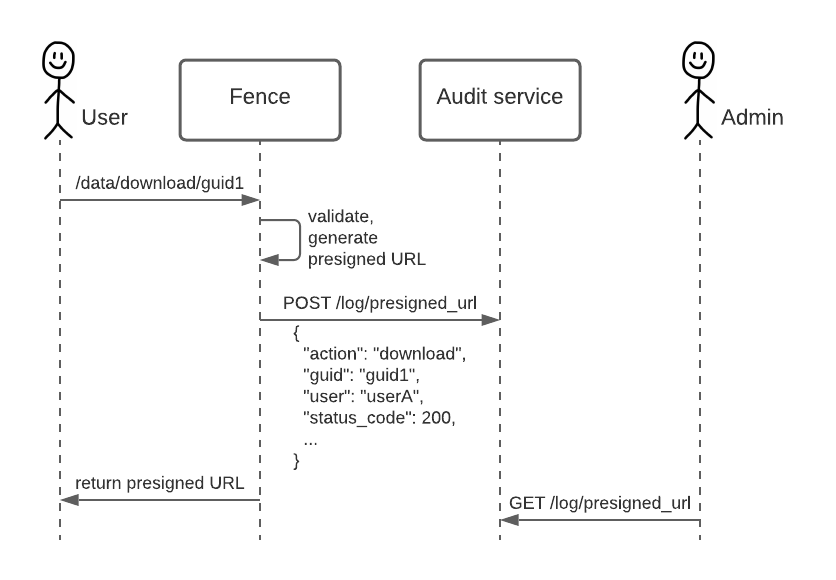

# Audit Service architecture

* [Architecture diagram](#architecture-diagram)
* [Database](#database)
* [API](#api)
* [Authorization](#authorization)

## Architecture diagram



## Database

Logs are stored in a PostgreSQL database. The following columns are common to all the log tables:
- request_url
- status_code
- timestamp
- username
- sub

Each log category contains additional fields. For example, the `presigned_url` table includes the following additional columns:
- guid
- resource_paths
- action
- protocol

For query performance and scalability as data accumulates, the tables are partitioned by month. We could also add indexes in the future if needed.

## API

The query endpoint only returns up to a configured maximum number of entries at a time. If there are more entries to query, it returns a non-null `nextTimeStamp` field, which can be used to get the next page. [More details in the "Query response page size" documentation.](../explanation/query_page_size.md)

The returned entries are ordered by increasing timestamp (least recent to most recent), so that new entries are at the end and there is no risk of skipping entries when getting the next page.

Filters can be added as query strings. Accepted filters include all fields for the queried category, as well as the following special filters:
- "groupby" to get counts
- "start" to specify a starting timestamp. Default: none
- "stop" to specify an end timestamp. Default: none

If queries are time-boxed (depends on configuration variable `QUERY_TIMEBOX_MAX_DAYS`), (`stop` - `start`) must be lower than the configured maximum.

We can populate the Audit Service database with historical data by parsing logs and making POST requests to create audit entries, because the log creation endpoint accepts the timestamp as an optional parameter.

About retention: for now, there is no planned mechanism to delete old entries.

## Authorization

The POST endpoint is not exposed. Only internal services can use it.

The GET endpoint is exposed and protected by Arborist policies on resources with the following syntax: `/audit/<category>`. See the `user.yaml` extract below for guidance on how to configure user access to audit logs. For presigned URLs, we could use `/audit/presigned_url/<resource_path>` if needed in the future (not implemented).

**Note:** The Audit Service can be deployed to a Data Commons without granting any users access to make queries: the audit data would only be available by database query or internal API call by an administrator.


```yaml
authz:
  resources:
  - name: audit
    subresources:
    - name: presigned_url
    - name: login

  roles:
  - id: audit_reader
    permissions:
    - id: audit_reader_action
      action:
        service: audit
        method: read

  policies:
  - id: audit_reader
    role_ids:
    - audit_reader
    resource_paths:
    - /services/audit
  - id: presigned_url_audit_reader
    role_ids:
    - audit_reader
    resource_paths:
    - /services/audit/presigned_url
  - id: login_audit_reader
    role_ids:
    - audit_reader
    resource_paths:
    - /services/audit/login

  groups:
  - name: login_audit_readers
    policies:
    - audit_reader
    users:
    - user1
    - user2
  - name: all_audit_readers
    policies:
    - audit_reader
    users:
    - user3
```
